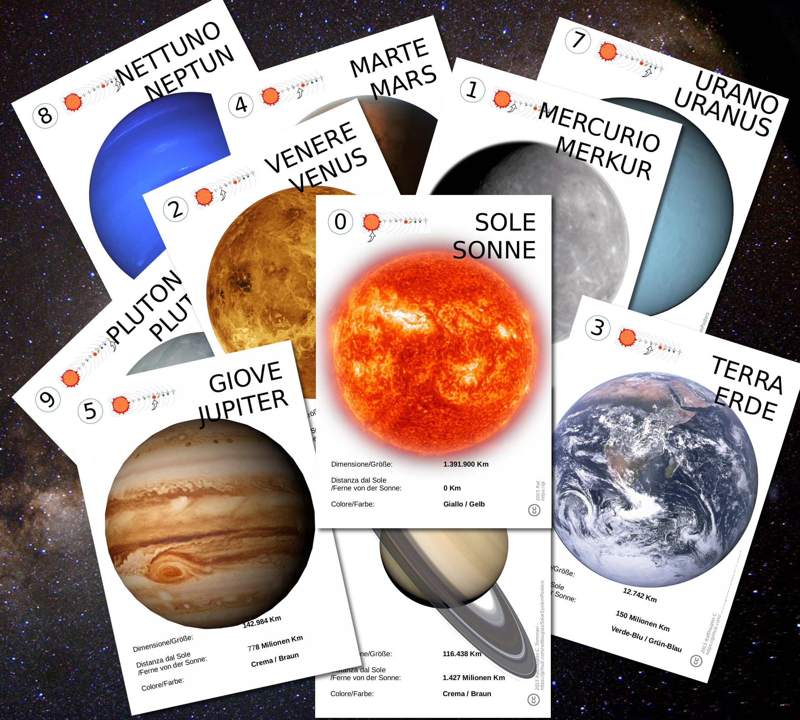

# SolarSystemPosters
A series of A4-posters of the Solar system. 
Suitable for the primary school.
Full color, printable, modifiable.

There are 10 A4 cards, one per planet (yes, there is also Pluto ;) ) and one for the Sun.

You can either use the ready-to-print 150dpi pdf, or modify the odg (with [LibreOffice](https://www.libreoffice.org/)) to suit it to your needs/language.

 All provided files are published under Creative Commons Attribution Share Alike 4.0.

## Each card features:
- A high quality picture of the planet
- A small map to show its relative position
- Some basic info (in Italian and German, at the moment)

## These are the cards:

Data from: [Exploratorium](http://www.exploratorium.edu/ronh/solar_system/)

@RafDouglas 2018
